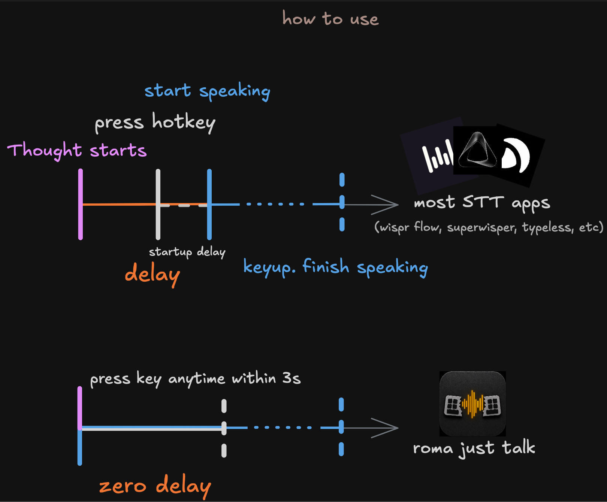

<div align="center">
  
  <h1>roma just talk</h1>
  <p>Turn dictation from sequential to parallel: speak while you trigger, instead of triggering before you speak.</p>
  

  [](https://www.gnu.org/licenses/gpl-3.0)
  
  [](https://github.com/happyf-weallareeuropean/roma-just-talk/releases)
  
  
 
  <a href="https://github.com/happyf-weallareeuropean/roma-just-talk/releases/latest">
    
  </a>
   <p>-87% bin size, -83% ram (780mb → 132mb). vs Wispr Flow.</p>
  <p>local & cloud STT solution both available.</p>
</div>

---

This [fork](https://github.com/Beingpax/VoiceInk) explores the other direction: keep a short rolling voice buffer, so the app can catch what you already started saying.



## What Makes This Different

- **Speak before the hotkey**: a short pre-roll buffer can include the words you said just before triggering capture
- **Pre-roll capture UX**: not always transcribing, just buffering enough that recording does not start from zero
- **Local or cloud**: use local models when you want control, cloud/custom models when you want speed, quality, or experiments
- **Less ceremony**: talk first, decide what to do with it second
- **Built on VoiceInk**: keeps the strong macOS base, shortcuts, dictionary, app-aware modes, and transcription pipeline

Current status: visible app branding uses roma-just-talk, while many internal labels still come from VoiceInk. The logo and source app icon use the roma-just-talk mark while the fork direction keeps moving first.

## Features

- 🎙️ **Pre-Roll Capture**: Keep a short mic buffer so the start of your thought is not lost
- 🧪 **Model Playground**: Run local models, cloud providers, or custom endpoints depending on the workflow
- ⚡ **Power Mode**: Intelligent app detection automatically applies your perfect pre-configured settings based on the app/ URL you're on
- 🧠 **Context Aware**: Smart AI that understands your screen content and adapts to the context
- 🎯 **Global Shortcuts**: Configurable keyboard shortcuts for quick recording and push-to-talk functionality
- 📝 **Personal Dictionary**: Train the AI to understand your unique terminology with custom words, industry terms, and smart text replacements
- 🔄 **Smart Modes**: Instantly switch between AI-powered modes optimized for different writing styles and contexts
- 🤖 **AI Assistant**: Built-in voice assistant mode for a quick chatGPT like conversational assistant

## Get Started

### Download
Download the latest fork release from [GitHub Releases](https://github.com/happyf-weallareeuropean/roma-just-talk/releases).

The source app icon now uses the roma-just-talk split-keyboard mark. Published downloads may still show older assets until the next release.

#### Homebrew
Upstream VoiceInk can also be installed via `brew`:

```shell
brew install --cask voiceink
```

### Build from Source
You can build the app yourself by following [BUILDING.md](BUILDING.md).

## Requirements

- macOS 14.4 or later

## Documentation

- [Building from Source](BUILDING.md) - Detailed instructions for building the project
- [Contributing Guidelines](CONTRIBUTING.md) - Original upstream contribution notes
- [Code of Conduct](CODE_OF_CONDUCT.md) - Our community standards

## Contributing

This fork is early. Issues, experiments, and focused patches are welcome when they help the pre-roll dictation direction.

Useful contributions right now:
- Reporting bugs via [issues](https://github.com/happyf-weallareeuropean/roma-just-talk/issues)
- Testing pre-roll capture in real macOS writing workflows
- Improving rough docs left over from the upstream project
- Proposing focused changes that make speak-before-hotkey dictation faster, calmer, or more reliable

For build instructions, see [BUILDING.md](BUILDING.md).

## License

This project is licensed under the GNU General Public License v3.0 - [learn more](LICENSE).

## Support

If you encounter any issues or have questions, please:
1. Check the existing issues in the GitHub repository
2. Create a new issue if your problem isn't already reported
3. Provide as much detail as possible about your environment and the problem

## Acknowledgments

roma-just-talk is built top on: [VoiceInk](https://github.com/Beingpax/VoiceInk).


### Core Technology
- [whisper.cpp](https://github.com/ggerganov/whisper.cpp) - High-performance inference of OpenAI's Whisper model
- [FluidAudio](https://github.com/FluidInference/FluidAudio) - Used for Parakeet model implementation

### Essential Dependencies
- [Sparkle](https://github.com/sparkle-project/Sparkle) - Keeping VoiceInk up to date
- [KeyboardShortcuts](https://github.com/sindresorhus/KeyboardShortcuts) - User-customizable keyboard shortcuts
- [LaunchAtLogin](https://github.com/sindresorhus/LaunchAtLogin) - Launch at login functionality
- [MediaRemoteAdapter](https://github.com/ejbills/mediaremote-adapter) - Media playback control during recording
- [Zip](https://github.com/marmelroy/Zip) - File compression and decompression utilities
- [SelectedTextKit](https://github.com/tisfeng/SelectedTextKit) - A modern macOS library for getting selected text
- [Swift Atomics](https://github.com/apple/swift-atomics) - Low-level atomic operations for thread-safe concurrent programming
- [PermissionFlow](https://github.com/jaywcjlove/PermissionFlow) - make granting permissions intuitive. they were inspired by when codex app shiped legendary `computer-use` tool alongside a never seen before way of permission granting flow.   


---

Built from VoiceInk, then pointed at speak-before-hotkey dictation.
